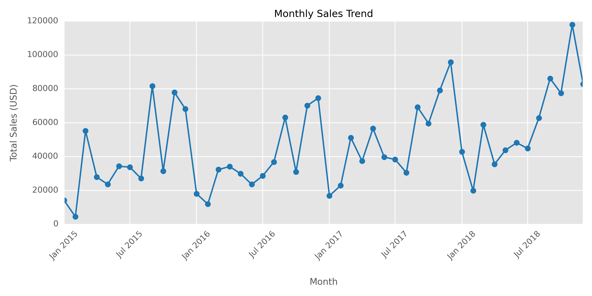

# Final sales rapport and conclutions

This report summarizes the findings obtained from the analysis of the store's sales dataset. It addresses temporal aspects, logistics, order behavior, geographic segmentation, customer analysis, products, and sales trends.

---

## 1. Temporal Coverage and Logistics Efficiency

- **Sales Period**:  
    - Orders span from **January 2015** to **December 2018**.  
    - Shipping dates extend to **January 2019**, indicating a long operational history to identify trends over time.

- **Shipping Time**:  
    - **Average order date**: ~May 1, 2017  
    - **Average shipping date**: ~May 5, 2017  
    - **Average shipping time**: Approximately **4 days**.  
    *This data is crucial for evaluating the efficiency of the logistics process.*

---

## 2. Nature of Orders

- **Multiplicity of Items**:  
    - There are **9800** entries, but only **4922 unique Order IDs**.  
    - *Conclusion*: Many orders include multiple products, which opens opportunities to analyze the "basket" size and develop cross-selling strategies.

---

## 3. Shipping Mode Preferences

- **Predominance of “Standard Class”**:  
    - Of the **9800** records, **5859** use “Standard Class”.  
    - *Observation*: This mode may be the default or the most economical option, influencing shipping cost optimization and delivery expectation management.

---

## 4. Customer Segmentation and Geography

- **Customer Segments**:  
    - The **“Consumer”** segment dominates with **5101** records, indicating that most orders come from individual consumers.

- **Geographic Location**:  
    - **Country**: All orders are from the United States.  
    - **Regional Concentration**:
        - **California**: 1946 records  
        - **New York City**: 891 records  
        - **“West” Region**: 3140 records  
    *These data are useful for focusing marketing and logistics strategies in specific areas.*

---

## 5. Customer Analysis

- **Customer Diversity**:  
    - There are **793 unique customers**, suggesting a diverse customer base.

- **Recurring Customers**:  
    - The customer **“William Brown”** is the most active, with **35 orders**.  
    *Recommendation*: Identify these high-value customers to design loyalty programs or special promotions.

---

## 6. Product and Category Behavior

- **Wide Catalog**:  
    - There are **1849 product names** and **1861 unique IDs**, indicating a broad portfolio.

- **Predominant Category**:  
    - **“Office Supplies”** is the most frequent category, with **5909** records.  
    - Within it, the subcategory **“Binders”** stands out with **1492** records.

- **Highlighted Products**:  
    - The product **“Staple envelope”** appears 47 times.  
    - The ID **“OFF-PA-10001970”** is the most frequent (19 times).  
    *This analysis helps identify key high-demand products for future promotions.*

---

## 7. Sales Analysis

- **Sales Variability**:  
    - **Average sale**: ~230.77 USD  
    - **Standard deviation**: ~626.65 USD  
    - **Maximum value**: 22638.48 USD  
    *Interpretation*: There is a very skewed distribution in sales, with some extremely high-value orders that may represent special cases (such as corporate or special orders).

---

## 8. Additional Observations

- **Missing Data**:  
    - The **“Postal Code”** field has 9789 records instead of 9800, indicating the presence of some missing data.
    
- **Complementary Analyses**:  
    - Seasonal trends, correlations between product categories and regions, or the impact of shipping mode on customer satisfaction could be explored.

---

## Conclusions

The analysis reveals that the store has a long sales history and considerable diversity in customers and products. The logistics efficiency, reflected in an average shipping time of 4 days, is a strong point. However, the high variability in sales suggests the presence of outliers or exceptional orders that may represent unique opportunities.

*Recommendation*: Conduct complementary analyses to identify optimization opportunities in marketing, logistics, and loyalty strategies, leveraging segmented information by regions and categories.

---

*This final report provides a comprehensive view of the data and lays the foundation for future research and business operation improvements.*